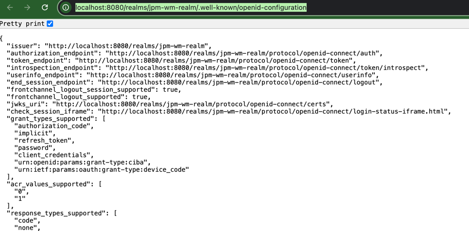

# Wealth-Management-Platform
The Investment Banking Platform is a modern, production-ready application designed for wealth management and financial planning. Built with Spring Boot and ReactJS/TypeScript, it leverages microservices architecture for scalability and modularity. Key features include GraphQL APIs, Netflix DGS, Spring AI, and event-driven communication via Kafka.

## Table of Contents
- [Project Overview](#project-overview)
- [Plan](#plan)
- [Design](#design)
- [Backend Development](#backend-development)
- [Frontend Development](#frontend-development)
- [Testing](#testing)
- [Deployment](#deployment)

## Docker setup
docker run -p 8080:8080 -e KC_BOOTSTRAP_ADMIN_USERNAME=jpw-wm-admin -e KC_BOOTSTRAP_ADMIN_PASSWORD=jpw-wm-admin -d quay.io/keycloak/keycloak:26.1.4 start-dev
Container name : jpw-wm-dev 

## Create Realm
Name : jpm-wm-realm

## Configure Client 
Its a resource server, It host(api-gateway) the server to be secured. 
id: jpm-wm-client
Name : jpm-wm-client
desc : jpm-wm-client
client - auth : true
authorization - no
auth- flow : service acct roles
Root and home url : http://localhost:9090  --> API gateway
save client- secret : t002nhbUaT5qq4mxxcQ8ejNLuwLCeoDt
realm setting -> openId connect config: http://localhost:8080/realms/jpm-wm-realm/.well-known/openid-configuration
"issuer": "http://localhost:8080/realms/jpm-wm-realm",
"token_endpoint": "http://localhost:8080/realms/jpm-wm-realm/protocol/openid-connect/token",

## License
This project is licensed under the MIT License - see the [LICENSE](LICENSE) file for details.